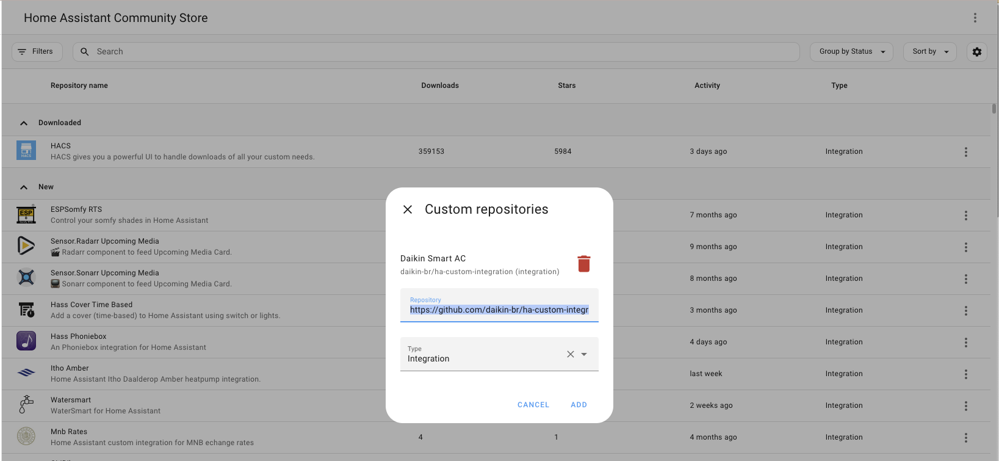

The **Daikin Smart AC** integration enables Home Assistant to control Daikin smart air conditioning systems.

## Supported hardware

This Home Assistant integration supports the Brazilian version of Daikin Smart AC products, which are operated by **Daikin Smart AC** mobile apps available on the following mobile platforms:

- [iOS](https://apps.apple.com/br/app/daikin-smart-ac/id1557849398)

- [Android](https://play.google.com/store/apps/details?id=in.co.iotalabs.dmb.smartac)

## Prerequisites

- The Daikin air conditioning device must already be added to your account using the Daikin Smart AC mobile app.

- The integration requires a **Device Key**. To retrieve the Device Key for the SSID (shown in the Home Assistant configuration UI during setup), open the Daikin Smart AC mobile app, navigate to **Menu -> Integrations -> Home Assistant**, enter or select the SSID, and press **Submit**.

## Installation

1. Download it with HACS

   - If **HACS is not installed**, follow this URL to install and set it up:
     [https://www.hacs.xyz/docs/use/download/download/](https://www.hacs.xyz/docs/use/download/download/).

2. Click on HACS and search for "**Daikin Smart AC**". If is not available then **ADD it manually** as shown below:

   - Repository: https://github.com/daikin-br/ha-custom-integration

   - Type: Integration

3. Restart Home Assistant

4. In the HA UI:
   - Go to "Settings" -> "Devices & Services" -> "Integrations", click "+" and search for "**Daikin Smart AC**"

## Configuration

To add the **Daikin Smart AC** integration to your Home Assistant instance, use the following My button:

Daikin Smart AC can be **auto-discovered** by Home Assistant. If an instance was found, it will be shown as **Discovered Device: DAIKINXXXXXX**. You can then click on `ADD` and follow the on screen instructions to set it up.

If it wasn’t discovered automatically, You can set up a manual integration entry:

- Browse to your Home Assistant instance.
- Go to Settings -> Devices & Services.
- In the bottom right corner, select the Add Integration button.
- From the list, select Daikin Smart AC.
- Follow the instructions on screen to complete the setup.

> ### Configuration Variables
>
> **Device IP Address (Optional):**
> description: "The IP address of your Daikin Smart AC device. This is only required when automatic device discovery does not work."
>
> **Device Name (Required):**
> description: "The name of your Daikin smart AC device."
>
> **Device Key (Required):**
> description: "The API key of your Daikin smart AC device. To get this key, open the Daikin Smart AC mobile app, navigate to **Menu -> Integrations -> Home Assistant**, enter or select the SSID, and press **Submit**."

### Note:

If your Daikin Smart AC unit is not on the same network as your Home Assistant instance (e.g., if your network is segmented), **automatic device discovery** may not work. In this case, you will need to manually find the **Device IP** by:

- Accessing your network router’s setup page and locating the client IP for the Daikin Smart AC device (hostname format: DAIKINXXXXXX).

**To configure the device, ensure the following ports are accessible:**

- From Home Assistant to the Daikin Smart AC Device : `TCP Port` => `15914`

- Default mDNS port.

If this applies to your setup, adjust your firewall settings to allow access to the required ports.

## Climate

The `daikin_br` climate platform integrates Daikin air conditioning systems with Home Assistant, allowing control over the following parameters:

- [**HVAC Mode**](https://www.home-assistant.io/integrations/climate/#action-climateset_hvac_mode) (`off`, `heat`, `cool`, `dry`, `fan_only`)

- [**Target Temperature**](https://www.home-assistant.io/integrations/climate#action-climateset_temperature)

- [**Fan Mode**](https://www.home-assistant.io/integrations/climate#action-climateset_fan_mode) (fan speed)

- [**Swing Mode**](https://www.home-assistant.io/integrations/climate#action-climateset_swing_mode)

- [**Preset Mode**](https://www.home-assistant.io/integrations/climate#action-climateset_preset_mode) (eco, boost)

The Current ambient temperature is also displayed.

## Data updates

The integration fetches data from the device every 10 seconds by default.
It is recommended not to reduce the polling time below 10 seconds. For users who want to set their own custom polling interval, they can [configure a custom polling interval](https://www.home-assistant.io/common-tasks/general/#defining-a-custom-polling-interval).

## Known limitations

Preset mode `Coanda` is currently not supported.

## Troubleshooting

### Can’t setup the device

#### Symptom: “Failed to connect”

When trying to setup the integration, the form shows the message “Failed to connect”.

##### Description

This indicates that either the device has gone offline or network firewall settings are blocking local communication.

##### Resolution

To resolve this issue, try the following steps:

1. Make sure your device is powered up.
2. Make sure your device is connected to the network:
   - Make sure the app of the manufacturer can see and operate the device.
3. Make sure the network firewall settings are not blocking the local communication on port 15914.

### I deleted my device from the manufacturer's app and added it again. After this, my device in Home Assistant appears offline or unavailable.

Reconfigure the device.

### The device is not getting auto discovered.

Make sure the network firewall settings are not blocking default mDNS port.

### The device is appearing offline or unavailable.

Make sure the device is visible and controllable via the manufacturer's app.
If it is not, check the device's power and network connection.

## Removing the integration

This integration follows standard integration removal. No extra steps are required. Refer to [Removing an integration instance](https://www.home-assistant.io/common-tasks/general/#removing-an-integration-instance) for details.

1. In Home Assistant, go to [**Setting->Device & Services**](https://my.home-assistant.io/redirect/integrations/).
2. Select the **Daikin Smart AC** integration and in the three-dot menu (⋮), select **Delete**.
3. [Restart Home Assistant](https://www.home-assistant.io/docs/configuration/#reloading-the-configuration-to-apply-changes).

## Contributions are welcome!

If you want to contribute to this please read the [Contribution guidelines](CONTRIBUTING.md)

---

[def]: https://www.hacs.xyz/docs/use/download/download/
